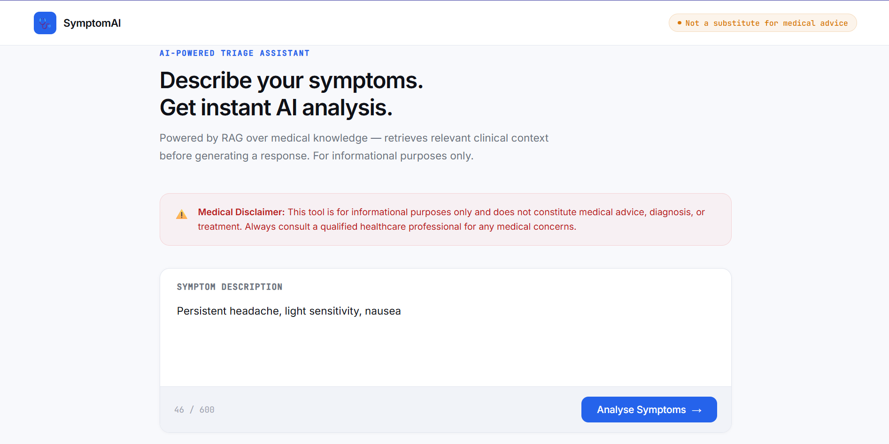
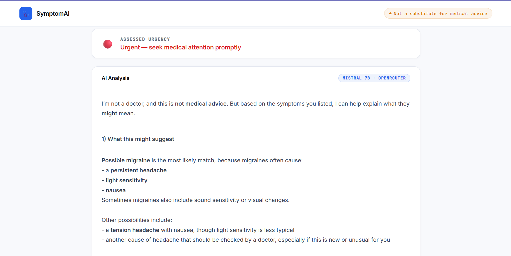
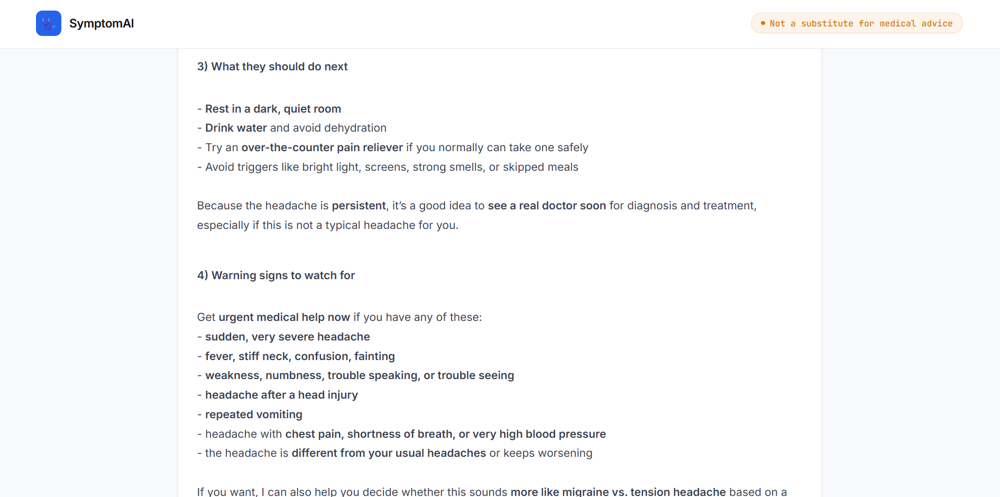

# Medical Symptom Analyser

An AI-powered triage assistant that takes symptom descriptions in plain English and returns structured clinical analysis using Retrieval-Augmented Generation. The system retrieves relevant medical knowledge from a vector database before generating any response — grounding every output in context rather than relying purely on model memory.

For informational purposes only. Not a substitute for professional medical advice.

---

## Demo







---

## What It Does

Most people describe symptoms in plain English but receive either overly technical medical language or unreliable generic results. This tool bridges that gap by:

1. Taking a free-text symptom description from the user
2. Converting it into a semantic vector using a local embedding model
3. Searching a Pinecone vector index for the most relevant medical knowledge chunks
4. Passing the retrieved context + symptoms to a live LLM via OpenRouter
5. Returning a structured plain English response with severity assessment

| Feature | Detail |
|---|---|
| Severity Detection | Automatically classifies response as Mild / Moderate / Urgent |
| Structured Output | Four sections: possible conditions, seriousness, next steps, warning signs |
| RAG Context Panel | Collapsible section showing exactly what medical knowledge was retrieved |
| Medical Disclaimer | Persistent throughout the UI — never hidden |
| Example Chips | Pre-filled symptom examples for quick testing |

---

## Tech Stack

| Layer | Technology | Purpose |
|---|---|---|
| Backend | FastAPI | REST API, request handling |
| Vector Store | Pinecone | Stores and searches medical knowledge vectors |
| Embeddings | sentence-transformers (all-MiniLM-L6-v2) | Converts text to 384-dimension vectors locally |
| LLM | OpenRouter (auto routing) | Free LLM inference — auto-selects best available model |
| Frontend | HTML / CSS / JavaScript | Clean clinical UI with markdown rendering |
| Server | Uvicorn | ASGI server for FastAPI on Windows |

All embeddings run locally. No data sent to external services except OpenRouter for LLM inference.

---

## Project Structure

```
medical-symptom-analyser/
├── static/
│   └── index.html        # Frontend UI
├── main.py               # FastAPI backend — routes and request handling
├── rag.py                # RAG pipeline — retrieval + LLM chain
├── ingest.py             # One-time script to load knowledge into Pinecone
├── requirements.txt      # Python dependencies
├── .env                  # API keys (not committed)
├── .gitignore
└── README.md
```

---

## How It Works

```
User describes symptoms
         |
         v
sentence-transformers converts text → 384-dimension vector
         |
         v
Pinecone searches for top-3 closest medical knowledge chunks
         |
         v
rag.py bundles: symptoms + retrieved chunks → structured prompt
         |
         v
OpenRouter LLM reads context → generates plain English analysis
         |
         v
FastAPI returns: { symptoms, context, analysis }
         |
         v
Frontend renders severity badge + structured response + RAG panel
```

---

## Getting Started

### Prerequisites

- Python 3.10 or higher
- A free [Pinecone](https://pinecone.io) account
- A free [OpenRouter](https://openrouter.ai) account
- Windows OS (instructions use PowerShell)

### Installation

```bash
# Clone the repository
git clone https://github.com/yourusername/medical-symptom-analyser
cd medical-symptom-analyser

# Install dependencies
pip install -r requirements.txt
```

### Environment Setup

Create a `.env` file in the root directory:

```
PINECONE_API_KEY=your_pinecone_key_here
OPENROUTER_API_KEY=your_openrouter_key_here
```

### Load Medical Knowledge (Run Once)

```bash
python ingest.py
```

This creates a Pinecone index called `medical-knowledge`, embeds 20 medical knowledge chunks using `all-MiniLM-L6-v2`, and uploads them. Only needs to run once — knowledge persists in Pinecone.

### Run the App

```bash
python -m uvicorn main:app --reload
```

Navigate to `http://localhost:8000` in your browser.

---

## Knowledge Base

The current knowledge base covers 20 common conditions including influenza, strep throat, COVID-19, migraines, UTIs, asthma, anxiety, depression, pneumonia, appendicitis, GERD, and more. Each chunk includes symptom descriptions, severity guidance, treatment suggestions, and when to seek medical attention.

To expand the knowledge base, add entries to the `medical_knowledge` list in `ingest.py` and re-run the script.

---

## Requirements

```
fastapi
uvicorn
langchain
langchain-community
langchain-core
pinecone
sentence-transformers
openai
python-dotenv
python-multipart
```

---

## Medical Disclaimer

This tool is for informational and educational purposes only. It does not constitute medical advice, diagnosis, or treatment. The AI responses are generated from a limited knowledge base and should never replace consultation with a qualified healthcare professional. Always seek the advice of your physician or other qualified health provider for any medical concerns.

---

## What I Learned

- How RAG grounding works in practice — why retrieved context produces more accurate, safer responses than pure LLM generation
- How to build and query a Pinecone vector index from scratch including index creation, upserting vectors with metadata, and querying with top-k retrieval
- How sentence-transformers embed text into fixed-dimension vectors and why the same model must be used for both ingestion and retrieval
- How OpenRouter provides a unified API across multiple free LLM providers using the OpenAI SDK interface
- How to implement safety-aware prompting for sensitive domains like healthcare

---